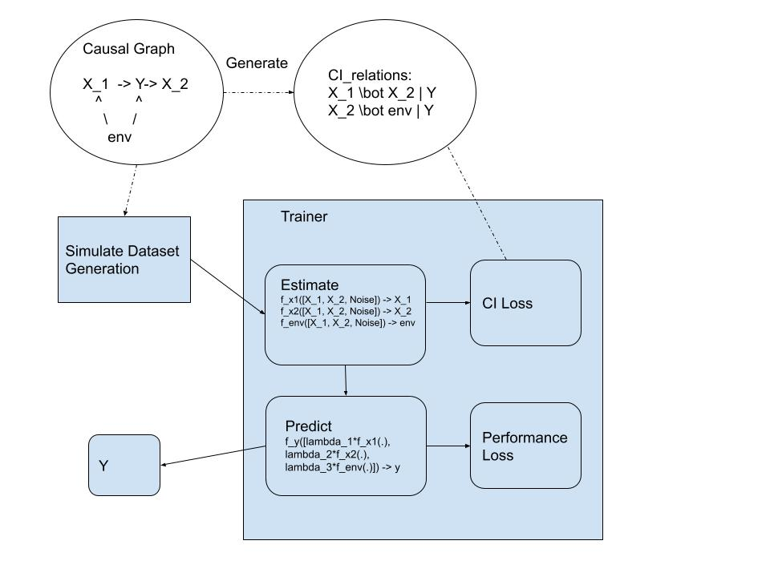

# cit-trainer

## Structure

- 

## StoryLine

TBD

## Expected Workflow

* Conditional Independent Tester with Gradient (Done)
* Structural Causal Model Trainer (Done)
* Simulated Dataset (Doing)
  * Data Generation (Done)
  * Toy Model(ToyEstimator; ToyRegressor) (Done)
  * Training
  * Evaluation
* Synthetic(NLP) Dataset (Pending)
* Result Analyze (Pending)
  * Graph1: X-axis(performance); Y-axis(lambda_CI);\
  * etc

